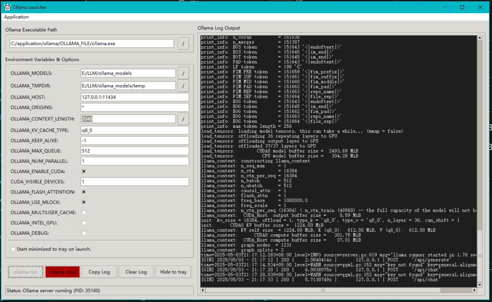

# ollama-launcher
A Better Ollama Service Launcher

中文说明：[Chinese readme](README_CN.md)

### Quick Start

Download the standalone executable for ollama-launcher: [click here](https://github.com/NGC13009/ollama-launcher/releases/)

Download the zip version of Ollama from [here](https://github.com/ollama/ollama/releases/) , extract it to a directory, and then configure the Ollama path in Ollama Launcher. You can then use the launcher to manage the startup of the `ollama serve` daemon. Avoid automatic updates, easily configure startup parameters, and conveniently view colored logs.

You can also obtain the latest Ollama zip download link via the menu bar at the top of the launcher.

### Introduction

- Ollama Launcher is a launcher for Ollama, which allows you to easily start and manage the Ollama service process.
- Ollama Launcher aims to simplify the configuration of startup parameters for the Ollama server. It eliminates the need to constantly modify environment variables or manually start/stop the background service. As a result, changing runtime parameters for the Ollama background service and managing service processes becomes much more convenient.
- Ollama Launcher does not manage models. That means it can only start and stop the Ollama service process, but cannot pull, run, or configure models. To manage models, you still need to use the command line.

The launcher is primarily designed to avoid automatic updates and provide easier configuration of startup parameters. Therefore, it is recommended to use the binary executable instead of installing via Ollama's setup installer: [Ollama download](https://github.com/ollama/ollama/releases ), download the zip package, extract it to a directory, add the `ollama.exe` path to your system's `Path` environment variable, then launch Ollama-Launcher and configure the path to `ollama.exe`.

If you prefer automatic updates, you can download the setup installer from the official Ollama website: [Ollama](https://ollama.com/ ) and install it directly. Then locate the `ollama.exe` path and configure it in Ollama Launcher. Please note that you should disable the default auto-start of Ollama at boot so that Ollama Launcher can fully manage the background service. When updating is needed, close Ollama Launcher first and start Ollama using the installed version to trigger an automatic update.

If you installed Ollama via the setup installer, the default installation path is:
`C:\Users\<YourUsername>\AppData\Local\Programs\Ollama\ollama.exe`
You need to set this path as the executable path within Ollama Launcher.

Additionally, you can customize the storage path for models (by default stored on the C drive). Note that this operation will not automatically move already downloaded models.

## Notes for the User Manual

+ The following functional descriptions are generated by AI. The author has not strictly reviewed the content, only briefly checked it.
+ Due to workload considerations, a Chinese version is temporarily unavailable. (But there's not much difficult vocabulary here that should be hard to understand, after all, there is an explanation)
+ The Chinese instructions are accurate, while the English ones are machine-translated. The content has not been rigorously reviewed, and accuracy is not guaranteed.
+ The manual is for reference only

## Feature Description

Ollama Launcher includes the following features:
1. Start the Ollama service process (`ollama serve`)
2. Stop the Ollama service process (`ollama serve`)
3. Configure startup parameters (Ollama uses environment variables to set startup options, such as port, context size, and CUDA acceleration devices)
4. Support for minimizing to the system tray
5. Option to directly run in the background system tray upon startup
6. Convenient viewing of Ollama service runtime logs
7. Avoid Ollama update notifications (the downside is that you will need to update manually)
8. Cross-platform support (although only Windows has been tested; other platforms require self-compilation using PyInstaller)

## Usage Instructions

The Ollama Launcher is designed to simplify the management of the Ollama service process. The interface is mainly divided into two areas — left and right — along with a top menu bar, a bottom status bar, and action buttons.

### 1. Left Area (Configuration Panel)

#### 1.1 Environment Variables and Options

At the top: **Ollama Executable Path** — This field is used to specify the full path to the `ollama.exe` file (or the corresponding executable for your operating system). Users can either manually enter the path in the input box or click the "..." button on the right to browse the file system and select it.

At the bottom: **Checkbox (Auto start ollama & hide to tray on launch)** — When checked, launching the Ollama Launcher will automatically attempt to start the Ollama service and minimize the launcher window directly to the system tray.

#### 1.2 Environment Variables & Options

This is the core configuration area, which presents a list of various environment variables and startup options that can be passed to the Ollama server. Users can directly modify these values in the corresponding text fields.

1. **OLLAMA_MODELS**: Controls the **model storage location**. Specifies where Ollama loads models from and where downloaded model files are saved on disk.
2. **OLLAMA_TMPDIR**: Controls the **temporary file location**. Sets the directory where Ollama stores temporary files during operation (e.g., during model extraction or conversion).
3. **OLLAMA_HOST**: Controls **network interface binding**. Determines which network interface (IP address) and port number the Ollama service listens on for client requests. This affects whether the service is accessible locally or over the network.
4. **OLLAMA_ORIGINS**: Controls **API access permissions (CORS)**. Sets which origins (domains, IP addresses) are allowed to make cross-origin API calls to Ollama. This is related to browser security policies.
5. **OLLAMA_CONTEXT_LENGTH**: Controls **model processing capacity (context window)**. Sets the maximum length of text (in tokens) that the model can understand and generate — i.e., the size of the context window.
6. **OLLAMA_KV_CACHE_TYPE**: Controls **model cache precision**. Configures the quantization type used for Key/Value caches during inference, affecting memory usage and potentially performance or accuracy.
7. **OLLAMA_KEEP_ALIVE**: Controls **model loading duration**. Specifies how long a model remains loaded in memory (RAM or VRAM) after it has not been used. Affects response speed when the model is called again and system resource usage.
8. **OLLAMA_MAX_QUEUE**: Controls **maximum request queue size**. When the server is busy, this sets the maximum number of incoming requests that can be queued for processing. Impacts handling capacity under high concurrency.
9. **OLLAMA_NUM_PARALLEL**: Controls **parallel processing capability**. Sets how many inference requests Ollama can process simultaneously. Affects server throughput and resource utilization.
10. **OLLAMA_ENABLE_CUDA**: Controls **NVIDIA GPU acceleration**. Determines whether NVIDIA CUDA technology is used to leverage GPU computing power for acceleration.
11. **CUDA_VISIBLE_DEVICES**: Controls **which NVIDIA GPUs to use**. If multiple NVIDIA GPUs are present in the system, this variable specifies which one(s) Ollama should use (by index number).
12. **OLLAMA_FLASH_ATTENTION**: Controls a **specific optimization technique**. Determines whether to enable the FlashAttention algorithm (an optimized method for Transformer attention computation), which can improve inference speed and reduce GPU memory usage on compatible hardware.
13. **OLLAMA_USE_MLOCK**: Controls **memory locking behavior (mainly for Linux/macOS)**. Determines whether to attempt to lock model data in physical memory (RAM) to prevent the operating system from swapping it to slower disk storage, ensuring performance stability.
14. **OLLAMA_MULTITASK_CACHE**: Controls **multi-task caching strategy**. Adjusts caching mechanisms related to running multiple models or handling different types of tasks simultaneously, which may impact performance in those scenarios.
15. **OLLAMA_INTEL_GPU**: Controls **Intel GPU acceleration**. Determines whether to try using Intel integrated or discrete GPUs for computational acceleration.
16. **OLLAMA_DEBUG**: Controls **log verbosity**. Determines whether Ollama outputs more detailed debugging information to logs, useful for troubleshooting issues.

These items are environment variables used to configure the behavior of the Ollama server. Modifying these values will affect how the Ollama service operates after it is started:

#### 1.3 Action Buttons

- **Ollama Run**: Starts the Ollama service process.
- **Ollama Stop**: Stops the currently running Ollama service process.
- **Copy Log**: Copies all content from the log area on the right to the clipboard.
- **Clear Log**: Clears the displayed content in the log area on the right.
- **Hide to Tray**: Minimizes the launcher window to the system tray.
- **Bottom Status Bar**: Displays the status of the most recent operation.

### 2. Right Area (Log Output Panel)

**Ollama Log Output**: This is a text display area that shows, in real-time, the startup messages, runtime status, warnings, and errors from the Ollama service process, as well as operation logs from the launcher itself. The logs include timestamps, log levels (e.g., [app info], [app warn]), and the

### 3. Top Menu Bar

Contains three menu items: **App**, **Action**, and **Info**.

#### 3.1 App Menu

- **Hide to Tray**: Minimizes the Ollama Launcher window to the system tray (notification area of the taskbar). This function is the same as the "Hide to tray" button on the main interface.
- **Print Welcome**: Reprints the welcome message that appears at program startup into the log output area on the right.
- **Edit additional Environment**: Edit additional environment variables. Allows users to add or modify other Ollama-related environment variables that are not displayed by default in the "Environment Variables & Options" list on the main interface, or manage them in different ways.
- **Save Config**: Saves the current configuration. All changes made in the interface (including the Ollama executable path, values of all environment variables, etc.) will be saved to a configuration file (the `config.json` mentioned in the status bar), so they can be loaded the next time the program starts. Manual saving is usually unnecessary, as the application automatically saves settings when exiting.
- **Reset Config**: Resets the configuration. Restores all settings to their default values or the initial state defined in the configuration file.
- **Exit**: Exits the Ollama Launcher application.

#### 3.2 Action Menu

- **▶ Ollama Run**: Starts the Ollama service process. This function is the same as the "Ollama Run" button on the main interface. The "▶" icon in front indicates start/run.
- **■ Ollama Stop**: Stops the currently running Ollama service process. This function is the same as the "Ollama Stop" button on the main interface. The "■" icon in front indicates stop.
- **Save Log**: Saves the log content displayed in the "Ollama Log Output" area on the right to a text file.
- **Copy Log**: Copies all content from the log area on the right to the system clipboard. This function is the same as the "Copy Log" button on the main interface.
- **Clear Log**: Clears the displayed content in the log area on the right. This function is the same as the "Clear Log" button on the main interface.

#### 3.3 Info Menu

- **Help**: Displays help information for this page.
- **About**: Displays about information. A window will pop up showing the name, version number, developer information, copyright notice, and other details of this Ollama Launcher application.

### 4. System Tray

Right-clicking the system tray icon provides a menu, which is very convenient when minimized to the tray.

- **Show Launcher**: Displays the launcher. Clicking this option will redisplay the previously hidden or minimized Ollama Launcher main window, bringing it to the front of the screen.
- **▶ Ollama Run**: Runs Ollama. Used to start the Ollama service process. This has the same function as the "Ollama Run" button in the main window and the "Ollama Run" option in the "Action" menu.
- **■ Ollama Stop**: Stops Ollama. Used to stop the currently running Ollama service process. This has the same function as the "Ollama Stop" button in the main window and the "Ollama Stop" option in the "Action" menu.
- **Exit**: Exits. Completely closes the Ollama Launcher application. Typically, exiting the launcher also stops the Ollama service process started by it.

### 5. Notifications

The launcher sends notifications through the system notification channel when the Ollama service starts and stops.

1. **Startup Notification**: When `ollama serve` starts, displays the PID (process number) of the started Ollama service along with the current timestamp.
2. **Shutdown Notification**: When `ollama serve` stops for some reason (user operation or abnormal exit), displays the exit code of the Ollama service shutdown along with the current timestamp.

### 6. Pop-up Windows

Some errors that cause significant interruptions are displayed via pop-up windows to provide more noticeable alerts to users.

## Get More Help / Report Issues / Discuss New Features

[GitHub Project Homepage](https://github.com/NGC13009/ollama-launcher.git ) (this page)

Please contact the author or submit an issue if you encounter problems or want to discuss new features. You can open this page in your browser by clicking the button at the bottom of the About page.

---------------

## For developer

### 编译说明

使用conda时，为了兼容多个环境，一般将pyinstaller安装在base环境，并配置环境变量，此时pyinstaller可以在任何环境下正常打包。以此避免安装多个pyinstaller或者对于不同环境配置pyinstaller的执行路径环境变量。

然而，如果使用Windows系统，并且miniconda（或conda）安装在某个需要管理员权限的目录下，那么pyinstaller可能打包会出现问题（表现为找不到库，或者打包成功，但是运行时提示缺少相关的包）。这可能是由于pyinstaller无法在用户权限访问它自己的缓存文件导致的，因为这些文件在base环境，而这些目录是管理员权限才可用的。

此时，打包时使用的PowerShell必须是具备管理员权限的，才能成功。如果打包失败，可以检查是否是这个原因导致的。

### TODO

1. [x]中英文帮助
2. [o]ANSI彩色字符显示
3. [x]bool框的默认选中是叉叉太离谱了
4. [o]启动最小化
5. [x]ollama ps，ollama ls等
6. [o]复制log出来
7. [o]所有输出尽量不用msgbox而使用log
8. [x]设置项目可折叠
9. [o]默认尺寸
10. [o]增加hide按钮
11. [o]时间戳
12. [o]存日志
13. [o]打包
14. [o]修改帮助提示
15. [o]tray启动时启动ollama
16. [o]逻辑
17. [o]检查操作日志是否存在打印？
18. [o]托盘按钮
19. [o]自定义环境变量
20. [o]一些日志最好把时间戳加上
21. [o]ollama服务的颜色怎么显示？
22. [o]自动换行
23. [o]相关网页增加打开快速链接
24. [o]修复子进程不正常退出的bug
25. [o]检查配置
26. [o]防止输入错误的配置到一些输入框
27. [o]舒适颜色
28. []重写教程

