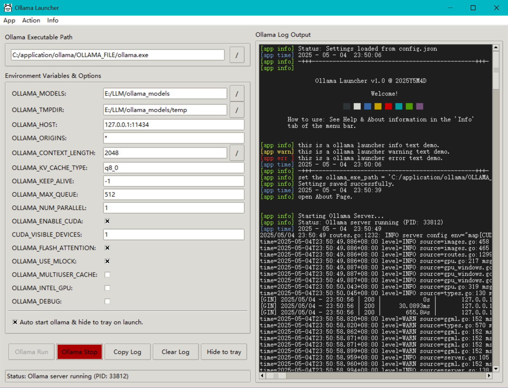

# ollama-launcher
better launcher of ollama

中文说明：[Chinese readme](README_CN.md)

Ollama Launcher is a launcher for ollama that simplifies starting and managing ollama service processes. It aims to streamline configuration of ollama server startup parameters, eliminating the need to constantly modify environment variables or manually start/stop daemon processes. With Ollama Launcher, modifying runtime parameters of the ollama daemon and managing service startup/stopping becomes much more convenient.

**Note**: Ollama Launcher cannot manage models - it can only start and stop ollama service processes, not pull, run, or configure models. To manage models, you will still need to use the command line interface.

**Direct executable download link for ollama-launcher:** [click here](https://github.com/NGC13009/ollama-launcher/releases/tag/v1.0)

The launcher is primarily designed to prevent automatic updates and make it more convenient to set startup parameters. Therefore, we recommend using the binary executable instead of installing via the Ollama setup installer:  
[Ollama downloads](https://github.com/ollama/ollama/releases) — download the zip package, extract it to a desired path, and add the `ollama.exe` file to your system's environment variable `Path`. Then launch ollama-launcher and configure the path to `ollama.exe`.

If you still prefer automatic updates, download the setup installer from the official Ollama website: [ollama](https://ollama.com/) and install it directly. Then locate the `ollama.exe` path and configure it in ollama-launcher. Please note that you need to disable Ollama’s default auto-startup at login, so that ollama-launcher can fully manage the background service. When you want to update, simply close ollama-launcher and launch the installed Ollama application, which will trigger an automatic update.

If you used the Ollama setup installer, the default path will be:  
`C:\Users\<YourUsername>\AppData\Local\Programs\Ollama\ollama.exe`  
You should configure this path inside ollama-launcher for launching Ollama.

Additionally, you can also customize the model storage path (default is on the C drive). Note that this operation does **not** automatically move any already downloaded models.

## Important Notes

1. This program was generated by Gemini 2.5 Pro and has not undergone rigorous testing.
2. The following functional descriptions were also AI-generated. The author has not thoroughly reviewed the content, just briefly glanced through it.
3. Due to workload constraints, there is currently no Chinese version (though the English terms are quite straightforward to understand).
4. The English description is machine-translated and has not been rigorously reviewed. Accuracy is not guaranteed.

## Feature Description

Ollama Launcher includes the following features:
1. Start ollama service process (ollama serve)
2. Stop ollama service process (ollama serve)
3. Configure startup parameters (ollama uses environment variables for settings such as port, context size, CUDA device selection)
4. Support minimizing to system tray
5. Support launching directly into background tray
6. Convenient log viewing for ollama service
7. Avoid ollama upgrade prompts (drawback is needing manual updates)
8. Cross-platform support (untested on platforms other than Windows, requires pyinstaller compilation)

## Usage Guide

Ollama Launcher aims to simplify management of the Ollama service process. The interface is mainly divided into left and right sections, with a top menu bar, bottom status bar, and action buttons.

### 1. Left Area (Configuration Section)

#### 1.1 Environment Variables & Options

At the top: "Ollama Executable Path" specifies the complete path where ollama.exe (or corresponding OS executable) is located. Users can manually input this in the text box or click the "..." button to browse the file system.

At the bottom: Checkbox "Auto start ollama & hide to tray on launch" - When checked, when launching the Ollama Launcher program, it will automatically attempt to start the Ollama service and minimize its window to the system tray area.

#### 1.2 Environment Variables & Options

This is the core configuration area, displaying various environment variables and startup options that can be passed to the Ollama server in list form. Users can directly modify these values in the corresponding text boxes.

1. OLLAMA_MODELS: Controls model storage location. Specifies where Ollama loads models from and saves downloaded model files to on disk.
2. OLLAMA_TMPDIR: Controls temporary file location. Specifies the directory where Ollama stores temporary files during operation (such as model decompression and conversion).
3. OLLAMA_HOST: Controls network listening configuration. Determines which network interface (IP address) and port number the Ollama service binds to for receiving client requests. This affects service accessibility (local access vs LAN access).
4. OLLAMA_ORIGINS: Controls API access permissions (CORS). Sets which sources (domains, IP addresses) are allowed to make cross-domain calls to Ollama's API interfaces. This relates to browser security policies.
5. OLLAMA_CONTEXT_LENGTH: Controls model processing capability (context window). Sets the maximum text length (in tokens) that the model can understand and generate.
6. OLLAMA_KV_CACHE_TYPE: Controls model cache precision. Configures the quantization type used for Key/Value caches during inference, affecting memory usage and potential performance/precision balance.
7. OLLAMA_KEEP_ALIVE: Controls model loading duration. Specifies how long a model remains loaded in memory (RAM or VRAM) after it's no longer being used. Affects response speed when reusing the model and system resource usage.
8. OLLAMA_MAX_QUEUE: Controls request queue limit. When the server is busy, this sets the maximum number of requests that can be received and queued for processing. Affects request handling capacity under high concurrency.
9. OLLAMA_NUM_PARALLEL: Controls parallel processing capability. Sets how many inference requests Ollama can process simultaneously. Affects server throughput and resource utilization.
10. OLLAMA_ENABLE_CUDA: Controls NVIDIA GPU acceleration. Determines whether to enable NVIDIA's CUDA technology for GPU-based computation acceleration.
11. CUDA_VISIBLE_DEVICES: Controls which NVIDIA GPUs to use. If the system has multiple NVIDIA GPUs, this variable specifies which one(s) Ollama should use (by index number).
12. OLLAMA_FLASH_ATTENTION: Controls specific optimization techniques. Determines whether to enable FlashAttention algorithm (an optimized method for Transformer attention calculations), which can improve inference seped and reduce VRAM usage on compatible hardware.
13. OLLAMA_USE_MLOCK: Controls memory locking behavior (mainly for Linux/macOS). Determines whether to try locking model data in physical memory (RAM) to prevent the operating system from swapping it to slower disks, esnuring performance stability.
14. OLLAMA_MULTITASK_CACHE: Controls multi-task caching strategy. Adjusts caching mechanisms related to running multiple models or handling multiple task types simultaneously, potentially affecting performance in these secnarios.
15. OLLAMA_INTEL_GPU: Controls Intel GPU acceleration. Determines whether to try enabling Intel integrated or discrete graphics cards for computation acceleration.
16. OLLAMA_DEBUG: Controls log verbosity. Determines whether Ollama outputs more detailed debugging information to logs for troubleshooting purposes.

These items are environment variables used to configure Ollama server behavior. Modifying these values will affect how the Ollama service runs after startup:

#### 1.3 Action Buttons

- Ollama Run: Starts the Ollama service process.
- Ollama Stop: Stops the currently running Ollama service process.
- Copy Log: Copies all content from the log area on the right to the clipboard.
- Clear Log: Clears the displayed content in the log area on the right.
- Hide to Tray: Minimizes the current launcher window to the system tray.
- Bottom Status Bar: Displays the most recent operation status.

### 2. Right Area (Log Output Section)

"Ollama Log Output": This is a text display area that shows real-time Ollama service process startup information, runtime status, warnings, errors, and the launcher's own operation logs. You can see timestamps, log levels ([app info], [app warn], etc.), and specific log content.

### 3. Top Menu Bar

Contains three menu items: "App", "Action", and "Info".

#### 3.1 App Menu

- Hide to Tray: Minimizes the Ollama Launcher window to the system tray (notification area of the taskbar). This has the same function as the "Hide to Tray" button on the main interface.
- Print Welcome: Reprints the welcome message shown at program startup in the log output area on the right.
- Edit Additional Environment: Edits additional environment variables. Allows users to add or modify other Ollama environment variables not displayed by default in the "Environment Variables & Options" list on the main interface, or manage them differently.
- Save Config: Saves the current configuration. All changes made in the interface (including the Ollama executable path, values of all environment variables, etc.) are saved to a configuration file (the config.json mentioned in the status bar) for loading next time. Actually, manual saving isn't necessary since the program automatically saves on exit.
- Reset Config: Resets the configuration. Restores all settings to the program's default state or initial configuration file state.
- Exit: Exits the Ollama Launcher application.

#### 3.2 Action Menu

- ▶ Ollama Run: Starts the Ollama service process. This has the same function as the "Ollama Run" button on the main interface, with the "▶" icon indicating start/run.
- ■ Ollama Stop: Stops the currently running Ollama service process. This has the same function as the "Ollama Stop" button on the main interface, with the "■" icon indicating stop.
- Save Log: Saves logs. Saves the log content displayed in the "Ollama Log Output" area on the right to a text file.
- Copy Log: Copies logs. Copies all content from the log area on the right to the system clipboard. This has the same function as the "Copy Log" button on the main interface.
- Clear Log: Clears logs. Clears the displayed content in the log area on the right. This has the same function as the "Clear Log" button on the main interface.

#### 3.3 Info Menu

- Help: Displays this help information.
- About: Displays about information. Pops up a window showing the name, version number, developer information, copyright notices, etc., of this Ollama Launcher program.

### 4. System Tray

Right-clicking the system tray icon provides a menu, which is very convenient when minimized to the tray.

- Show Launcher: Shows the launcher. Clicking this option will redisplay the previously hidden or minimized Ollama Launcher main window, bringing it to the front of the screen.
- ▶ Ollama Run: Runs Ollama. Used to start the Ollama service process. This has the same function as the "Ollama Run" button in the main window and the "Ollama Run" option in the "Action" menu.
- ■ Ollama Stop: Stops Ollama. Used to stop the currently running Ollama service process. This has the same function as the "Ollama Stop" button in the main window and the "Ollama Stop" option in the "Action" menu.
- Exit: Exits. Completely closes the Ollama Launcher application. Typically, exiting the launcher also stops the Ollama service process started by it.

### 5. Notifications

The launcher sends notifications through the system notification channel when the ollama service starts and stops.

1. Startup Notification: When ollama serve starts, displays the PID process number of the started ollama service and the current timestamp.
2. Shutdown Notification: When ollama serve stops for some reason (user operation or abnormal exit), displays the exit code of the ollama service shutdown and the current timestamp.

### 6. Pop-up Windows

Some errors that cause non-negligible interruptions will be displayed through pop-up windows to provide more noticeable alerts to users.

## Getting More Help / Providing Feedback / Discussing New Features

GitHub Project Homepage: https://github.com/NGC13009/ollama-launcher.git (this page)

---------------

## For developer

### TODO

1. [x]中英文帮助
2. [o]ANSI彩色字符显示
3. [x]bool框的默认选中是叉叉太离谱了
4. [o]启动最小化
5. [x]ollama ps，ollama ls等
6. [o]复制log出来
7. [o]所有输出尽量不用msgbox而使用log
8. [x]设置项目可折叠
9. [o]默认尺寸
10. [o]增加hide按钮
11. [o]时间戳
12. [o]存日志
13. [o]打包
14. [o]修改帮助提示
15. [o]tray启动时启动ollama
16. [o]逻辑
17. [o]检查操作日志是否存在打印？
18. [o]托盘按钮
19. [o]自定义环境变量

