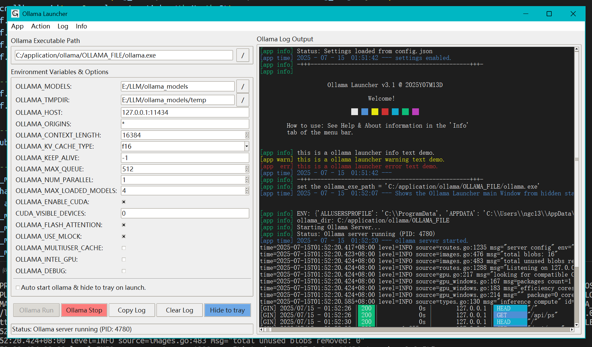
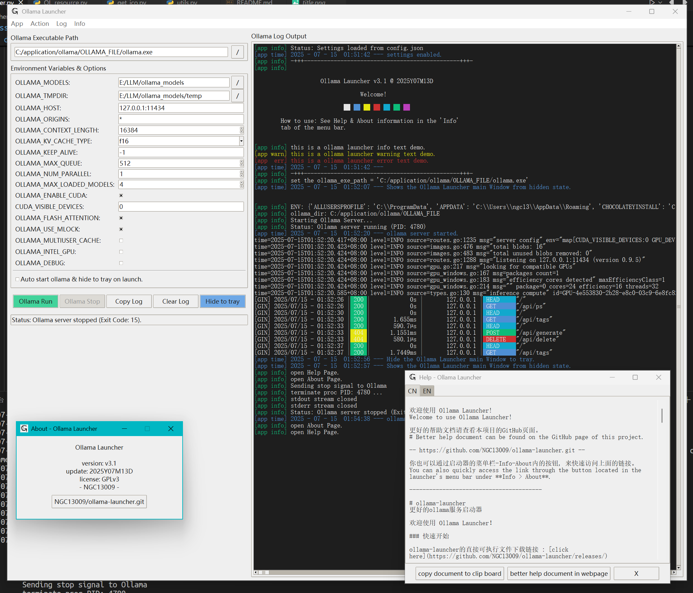

# ollama-launcher 完整说明书

更好的ollama启动器，支持更多可设置参数，允许快速启停，以及最小化至系统托盘等.



## 快速开始

1. 下载 ollama-launcher：[ollama-launcher的直接可执行文件下载链接](https://github.com/NGC13009/ollama-launcher/releases/)

2. 下载 ollama 本体：推荐从[这里](https://github.com/ollama/ollama/releases/)下载zip版本的ollama。

3. 分别解压 ollama-launcher 以及 ollama 到您希望安装的程序路径。（两者一般是不同的路径，例如您可以将ollama-launcher解压安装到`C:/application/ollama/ollama-launcher`，并同时将ollama解压安装到`C:/application/ollama/OLLAMA_FILE/`）

4. 之后，启动ollama-launcher并配置ollama的可执行文件路径。使ollama-launcher可以正确找到ollama并启动它。

5. 完成！可以开始启动一个 ollama 进程，按照需要快速配置，管理ollama的版本并升级等操作了。也可以正常通过api使用其他应用调用ollama进行LLM对话。（例如通过PowerShell或bash执行`ollama run qwen3:0.6b`与大模型对话）

6. 详细说明参考[说明书](Instructions_CN.md)

> 你也可以通过ollama-launcher上方的菜单栏，获取最新版的 ollama zip 的下载链接。
>
> 使用默认安装的ollama也可以，但是您需要手动关闭它的自动启动，并完全由ollama-launcher代理ollama的守护进程。如果不知道怎么做，那么推荐直接下载zip版本。
> 如果您使用ollama setup安装，那么默认路径是：
> 
> ```
> C:\Users\<你的用户名>\AppData\Local\Programs\Ollama\ollama.exe
> ```

Ollama Launcher 是 ollama 的启动器，可以方便地启动和管理 ollama 服务进程。

Ollama Launcher 旨在简化配置ollama server的启动参数。免去不断修改环境变量与启动停止守护进程的麻烦。如此一来，修改ollama守护进程的运行参数，启停服务进程将会更加方便。

Ollama Launcher 不能管理模型，即只能启动和停止 ollama 服务进程，不能拉取，运行，配置模型。为了配置模型，你仍旧需要使用命令行或其他程序。

由于功能简单，ollama-launcher 暂时只有英文版本。理论上看一遍说明应该也不影响使用了。

中文说明是准确的，英文说明是机翻的，没有严格审查内容，如果您发现有问题的地方，可以尝试提交一个修改（PR）。

由于更新不一定及时，说明书仅供参考，不一定是最新版的。

程序内提供了一个通过任务栏可打开的说明，允许在没有网络的时候查看说明内容。但是这个说明没有经过刻意的排版，比较简陋，内容完全与GitHub上的说明一致。



Ollama Launcher 的功能包括以下几点：
1. 启动 ollama 服务进程（`ollama serve`）
2. 停止 ollama 服务进程（`ollama serve`）
3. 配置启动参数（ollama通过环境变量设置启动参数，如端口、运行上下文，运行的CUDA加速设备）
4. 支持最小化到托盘
5. 支持启动后直接进入后台托盘
6. 方便的查看ollama服务运行日志
7. 避免ollama升级提示
8. 跨平台（Windows之外的其他平台没测试过，可能需要自行使用pyinstaller编译，不保证一定可用。一般来说，如果无法编译，大概率是您的Python环境的问题）

Ollama 启动器旨在简化 Ollama 服务进程的管理。界面主要分为左右两个区域，以及顶部的菜单栏、底部的状态栏和操作按钮。

### 1. 左侧区域 (配置区)

配置区是设置 Ollama 启动器的主要配置区域。这里可以设置各种环境变量和启动选项，以便更好地控制 Ollama 服务的行为。

#### 1.1. 环境变量与选项

最上方的：**Ollama Executable Path**: 用于指定 `ollama.exe`（或对应操作系统的可执行文件）所在的完整路径。用户可以通过输入框手动输入，或点击右侧的 "..." 按钮浏览文件系统来选择。
最下方的：**复选框 (Auto start ollama & hide to tray on launch)**: 勾选后，当启动这个 Ollama Launcher 程序时，它会自动尝试启动 Ollama 服务，并将自身窗口最小化到系统托盘区。

#### 1.2. Environment Variables & Options

这是核心配置区域，以列表形式展示了可以传递给 Ollama 服务器的各种环境变量和启动选项。用户可以直接在对应的文本框中修改这些值。

> tkinter编写的界面中，显示`×`则代表勾选选中（True，1），如果为空`  `则为未选中（False，0）。

1.    **OLLAMA_MODELS**: 控制 模型存储位置。指定 Ollama 从哪里加载以及将下载的模型文件保存到哪个磁盘目录。
2.    **OLLAMA_TMPDIR**: 控制 临时文件位置。指定 Ollama 在运行过程中（如模型解压、转换时）存放临时文件的目录。
3.    **OLLAMA_HOST**: 控制 网络监听配置。决定 Ollama 服务绑定到哪个网络接口（IP 地址）以及使用哪个端口号来接收客户端的请求。这影响了服务的可访问性（本机访问还是局域网访问）。
4.    **OLLAMA_ORIGINS**: 控制 API 访问权限 (CORS)。设置允许哪些来源（域名、IP地址）的前端应用跨域调用 Ollama 的 API 接口。这是浏览器的安全策略控制。
5.    **OLLAMA_CONTEXT_LENGTH**: 控制 模型处理能力 (上下文窗口)。设定模型能够理解和生成的最大文本长度（上下文窗口大小），以 token 数量衡量。
6.    **OLLAMA_KV_CACHE_TYPE**: 控制 模型缓存精度。配置模型在推理时使用的 Key/Value 缓存的量化类型，影响内存占用和可能的性能/精度平衡。
7.    **OLLAMA_KEEP_ALIVE**: 控制 模型加载时长。指定一个模型在没有被使用后，在内存（RAM 或 VRAM）中保持加载状态多长时间。影响再次调用该模型时的响应速度和系统资源占用。
8.    **OLLAMA_MAX_QUEUE**: 控制 请求排队上限。当服务器繁忙时，能接收并放入等待队列处理的最大请求数量。影响高并发下的请求处理能力。
9.    **OLLAMA_NUM_PARALLEL**: 控制 并行处理能力。设置 Ollama 可以同时处理多少个推理请求。影响服务器的吞吐量和资源利用率。
10.   **OLLAMA_ENABLE_CUDA**: 控制 NVIDIA GPU 加速。决定是否启用 NVIDIA 的 CUDA 技术来利用 GPU 进行计算加速。
11.   **CUDA_VISIBLE_DEVICES**: 控制 使用的 NVIDIA GPU。如果系统有多块 NVIDIA GPU，这个变量指定 Ollama 应该使用哪一块或哪几块 GPU（通过索引号）。
12.   **OLLAMA_FLASH_ATTENTION**: 控制 特定优化技术。决定是否启用 FlashAttention 算法（一种优化 Transformer 注意力计算的方法），可以在兼容的硬件上提升推理速度并减少显存占用。
13.   **OLLAMA_USE_MLOCK**: 控制 内存锁定行为 (主要用于 Linux/macOS)。决定是否尝试将模型数据锁定在物理内存（RAM）中，防止操作系统将其交换到速度较慢的硬盘上，以保证性能稳定性。
14.   **OLLAMA_MULTITASK_CACHE**: 控制 多任务缓存策略。调整与同时运行多个模型或处理多类型任务相关的缓存机制，可能影响这些场景下的性能。
15.   **OLLAMA_INTEL_GPU**: 控制 Intel GPU 加速。决定是否尝试启用 Intel 的集成显卡或独立显卡进行计算加速。（其他显卡不用勾选）
16.   **OLLAMA_DEBUG**: 控制 日志详细程度。决定 Ollama 是否输出更详细的调试信息到日志中，用于问题排查。

这些项目是用来配置 Ollama 服务器行为的环境变量。修改这些值会影响 Ollama 服务启动后的运行方式：

#### 1.3. 操作按钮

通过操作按钮，可以方便地启动、停止和管理 Ollama 服务进程。具体操作如下所示：

- **Ollama Run**: 启动 Ollama 服务进程。
- **Ollama Stop**: 停止当前正在运行的 Ollama 服务进程。
- **Copy Log**: 复制右侧日志区域的全部内容到剪贴板。
- **Clear Log**: 清空右侧日志区域显示的内容。
- **Hide to tray**: 将当前启动器窗口最小化到系统托盘区。
- **底部状态栏**：显示最近一次的操作状态。

> 关闭 ollama-launcher 时，如果有后台守护进程运行，会提示是否关闭所有ollama进程并退出，还是最小化到系统托盘。

### 2. 右侧区域 (日志输出区)

**Ollama Log Output**: 这是一个文本显示区域，用于实时展示 Ollama 服务进程的启动信息、运行状态、警告、错误以及该启动器本身的操作日志。可以看到时间戳、日志级别（[app info], [app warn] 等）和具体的日志内容。

### 3. 顶部菜单栏

包含 **App**, **Action**, **Log**, **Info** 这四个菜单项。主要是关于应用程序、操作、日志和信息的管理。菜单项一些操作和主界面的操作是重合的。

#### 3.1. App 菜单

app 菜单是用于管理ollama守护进程的主要菜单项。主要包括以下选项：

- **Hide to Tray**: 将 Ollama Launcher 程序的窗口最小化到系统托盘区（任务栏通知区域）。这和主界面上的 "Hide to tray" 按钮功能相同。
- **Print Welcome**: 在右侧的日志输出区域重新打印程序启动时的欢迎信息。
- **Edit additional Environment**: 编辑额外的环境变量。允许用户添加或修改一些没有在主界面“Environment Variables & Options”列表中默认显示的其他 Ollama 环境变量，或者是以不同方式管理它们。
- **Save Config**: 保存当前的配置。将你在界面上做的所有更改（包括 Ollama 可执行文件路径、所有环境变量的值等）保存到配置文件中，以便下次启动时加载这些设置。其实不用手动保存，因为程序退出时是自动- 保存的。
- **Reset Config**: 重置配置。将所有设置恢复到程序的默认状态或初始配置文件状态。
- **Exit**: 退出 Ollama Launcher 应用程序。

#### 3.2. Action 菜单

用于启停ollama守护进程。

- **▶ Ollama Run**: 启动 Ollama 服务进程。这和主界面上的 "Ollama Run" 按钮功能相同，前面的 "▶" 图标表示启动/运行。
- **■ Ollama Stop**: 停止当前正在运行的 Ollama 服务进程。这和主界面上的 "Ollama Stop" 按钮功能相同，前面的 "■" 图标表示停止。

#### 3.3. Log菜单

此处是关于日志的设置和操作。

- **Enable wrap**: 启用换行符。在日志输出中超出屏幕的部分会自动换行到下一行，以避免日志输出因超出屏幕被截断。
- **Disable wrap**: 禁用换行符。在日志输出中超出屏幕的部分不会自动换行到下一行，可以避免一个很长的内容将日志割裂开。
- **Save Log**: 保存日志。将右侧“Ollama Log Output”区域显示的日志内容保存到一个文本文件中。
- **Copy Log**: 复制日志。将右侧日志区域的全部内容复制到系统剪贴板。这和主界面上的 "Copy Log" 按钮功能相同。
- **Clear Log**: 清除日志。清空右侧日志区域显示的内容。这和主界面上的 "Clear Log" 按钮功能相同。

#### 3.4. Info 菜单

Info 菜单提供了关于 Ollama Launcher 程序以及系统信息的相关功能，具体包括以下内容：

- **Ollama webpage**: 打开 Ollama 官方网站，可以浏览 Ollama 的最新信息、文档和社区支持。
- **Ollama model list**: 显示可用的 Ollama 模型列表，帮助用户了解当前支持的模型种类。
- **Download Ollama**: 提供下载 Ollama zip 的链接，方便用户安装最新版本。
- **Open Ollama path**: 打开 Ollama 的安装目录，便于用户查看或自定义配置文件。
- **System info**: 显示当前系统的信息，如操作系统版本等，有助于用户了解运行环境。
- **Ollama version**: 显示当前 Ollama 的版本号，方便用户确认是否为最新版本。
- **Help**: 显示此页面的帮助信息。可以帮助用户了解如何使用 Ollama Launcher 的各项功能。
- **About**: 显示关于信息。如果需要更新 ollama-launcher，可以通过这里快速转到GitHub页面。

### 4. 系统托盘

右键系统托盘可获取一个菜单，这在最小化到托盘时操作将很方便。

- **Show Launcher**: 显示启动器。点击这个选项会将之前隐藏或最小化到托盘的 Ollama Launcher 主窗口重新显示出来，放到屏幕最前面。
- **▶ Ollama Run**: 运行 Ollama。用于启动 Ollama 服务进程。这和主窗口中的 "Ollama Run" 按钮以及 "Action" 菜单里的 "Ollama Run" 功能相同。
- **■ Ollama Stop**: 停止 Ollama。用于停止当前正在运行的 Ollama 服务进程。这和主窗口中的 "Ollama Stop" 按钮以及 "Action" 菜单里的 "Ollama Stop" 功能相同。
- **Exit**: 退出。完全关闭 Ollama Launcher 这个应用程序。通常情况下，退出启动器也会停止由它启动的 Ollama 服务进程。

### 5. 通知

启动器在ollama服务启动和停止的时候会通过系统通知渠道发送提示。

1. **启动提示**：`ollama serve` 启动时，展示启动的ollama服务 PID 进程号信息，以及当前时间戳。
2. **停止提示**：`ollama serve` 由于一些原因（用户操作或者异常退出）导致停止时，显示ollama服务的停止退出代码以及当前时间戳。

### 6. 弹出窗口

一些错误会导致不可忽略的中断，这些信息被设计为通过弹出窗口提示，以更加醒目的消息提醒用户。

## ⚠ 注意事项

当前程序不支持自动更新，需要手动更新。如果您觉得程序似乎显得有些过时，或者很久没更新过了，那么请转到关于（About）选项卡，查看这个仓库内最新版的程序并下载更新。

默认情况下，使用zip解压的ollama不会自动更新，需要手动检查更新（避免自动更新是最开始我写这个启动器的目的）。

第一次使用前，请配置模型存储路径，重新配置存储路径不会导致模型文件的搬移操作。一旦重设路径，你仍旧需要手动搬移这些模型。

## 获取更多帮助 / 问题反馈 / 新添加功能讨论

[GitHub 项目主页](https://github.com/NGC13009/ollama-launcher.git )

请联系作者或提交issue。你可以通过About页面下方的按钮在浏览器打开此页面。


